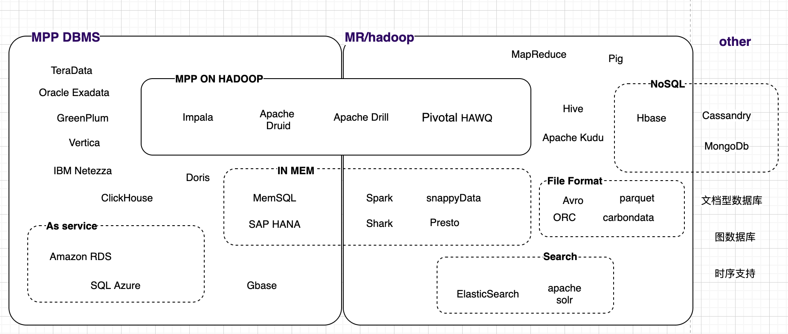
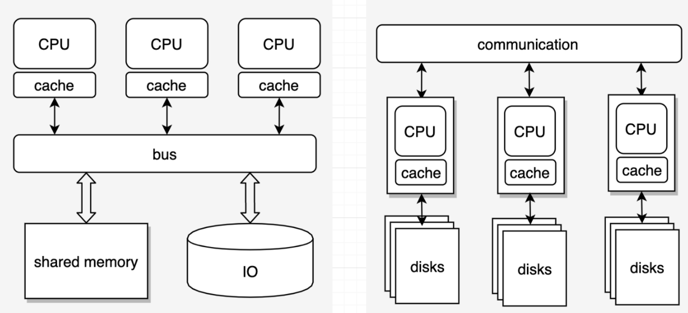

## 前言
随着IT技术的发展，企业、组织的数据量急剧增长已成了不争的事实，这也催生了数据存储、分析等相关技术的快速发展，大数据时代已经到来。由于大数据具有海量性、多样性、高速性等特点，传统的OLTP数据库已经力不从心。在这个背景下，以Hadoop为代表的新生分布式计算框架应运而生并得到了广泛的认可，同时传统数据库也增强自己的分布式、大规模并行计算能力，各种新的大数据平台或组件层出不穷，形成了今天百花齐放、百家争鸣的局面。

本人近几年从事大数据相关工作接触到很多类型的企业，他们在处理自己的数据资产时候，不可避免的会遇到各种问题。有一些传统型企业做数字化转型，面对增长的数据，困惑于应该选哪家的数据平台来做建设；也有一些互联网公司，团队对大数据的是有很好的技术基础，但随着场景的复杂化和业务的不断发展，原有已构建的大数据平台也受到了很大的挑战，迫切需要借鉴或接纳新的技术，对原有系统做扩展或增强。在工作中，本人以及团队调研和实践了多种大数据技术平台或组件，也对很多组件做过一些功能上的增强，本文对大数据技术相关的存储引擎和计算引擎方面做一些讨论，希望能在大数据技术选型方面提供些许帮助。

## 大数据技术类型

本人最初接触到大数据也是从hadoop和mapreduce开始的，后来逐渐熟悉了Hive、Hbase、Spark,以及流计算引擎等，随着接触面的扩大，常常感叹真是天外有天。对于眼花缭乱的大数据技术，做一个简单的分类：
MPP(Massively Parallel Processing) DBMS
Hadoop生态
MPP On Hadoop

[image-bigdata](https://app.diagrams.net/#G1dXQgwf5bRDk9UzNuiE1eWR5EHNrLrWCr)
需要声明的是，这个分类其实很不完整，如果较真儿的话，甚至有很多地方存在争议，我们求同存异暂且这么分类，便于讨论。

1.MPP DBMS
这类大数据平台通常由传统数据库发展而来。从技术特点来看，主要是无共享架构+分布式MPP。例如典型代表GreenPlum，基于PostgreSQL发展而来，2006年发布第一款产品，无共享MPP架构，用于数据分析OLAP。

SMP的全称是"对称多处理"（Symmetrical Multi-Processing）技术,这种架构汇集多个处理器，并使用共享内存，整体对外表现像个大单机，扩展开销大，扩展能力受到限制。而MPP架构尽管增加了通信的开销，但拥有更强的扩展能力，在大数据场景下优势明显。

2.HADOOP生态
HADOOP生态核心是HDFS和MapReduce算法。HDFS分布式文件系统拥有很强的扩展性，扩容简单，而MapReduce算法则提升了运算速率，二者结合，开启了大数据之门。在这基础上，发展出了众多项目，他们分别应对不同的场景。

3.MPP on HADOOP
HADOOP的MapReduce设计主要用来做批处理，对于习惯了SQL的DBA们来说会很别扭，于是诞生了HIVE这种基于SQL的平台，但其建立在mapReduce之上，速度差强人意。于是有了MPP和HADOOP的结合体，将数据存储在易扩展的hadoop上，而运算则使用MPP的运算方式，从而提升速度。

**MapReduce vs MPP**
上面忽视了一个问题，MapReduce是一个高效算法框架，为什么在实时分析时速度比不上MPP？

主要应用场景

Ad-hoc analysis

数据特点

不得不考虑的因素：成本

最终的选型还要考虑组织的技术偏向，数据迁移等因素。

融合发展是个趋势，批处理流处理融合，OLTP+OLAP融合

常见大数据系统/组件概要

---------
场景：
 
大数据场景如何分合理？
BI与OLAP
Ad-HOT
时序与实时流处理
查询引擎，计算框架

参考：
https://cloudblogs.microsoft.com/sqlserver/2014/07/30/transitioning-from-smp-to-mpp-the-why-and-the-how/
